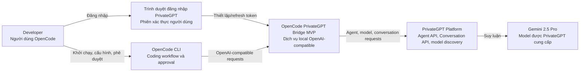
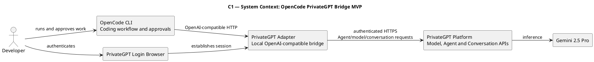
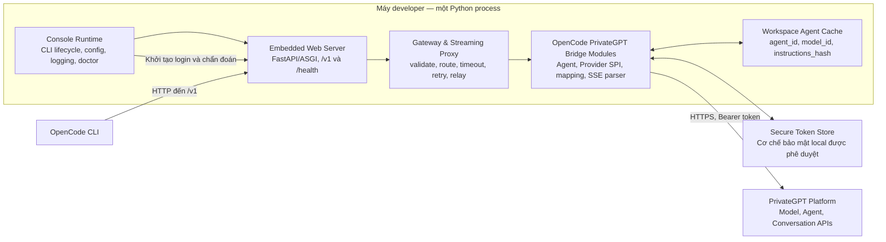
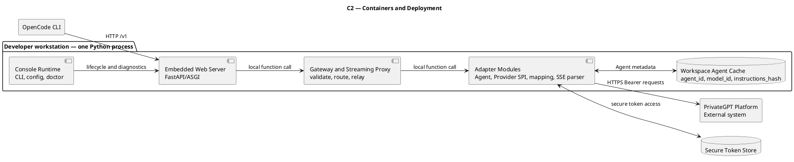
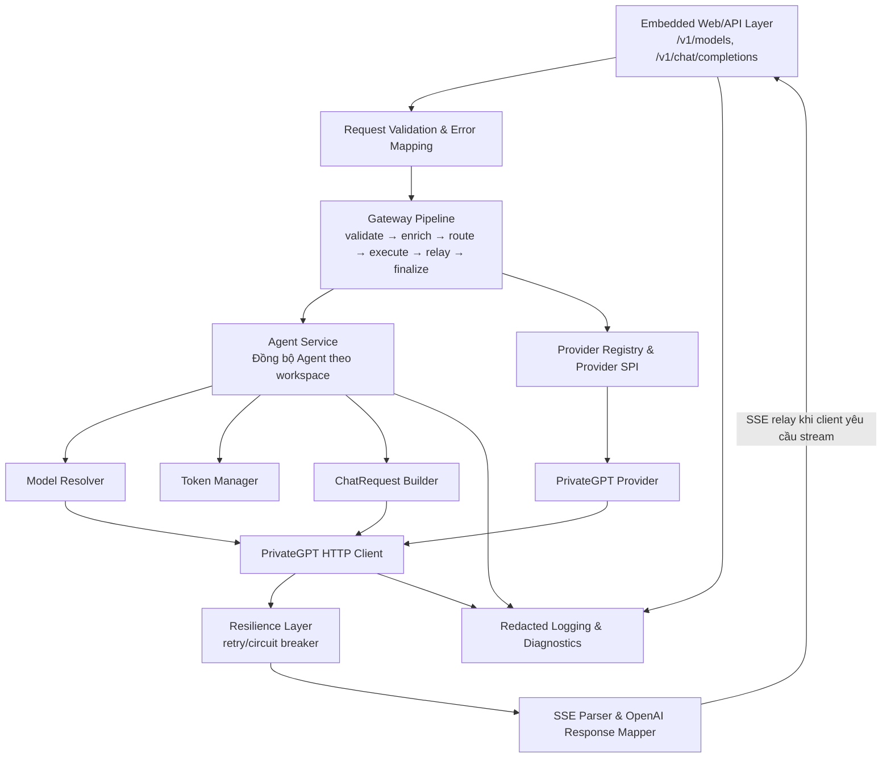
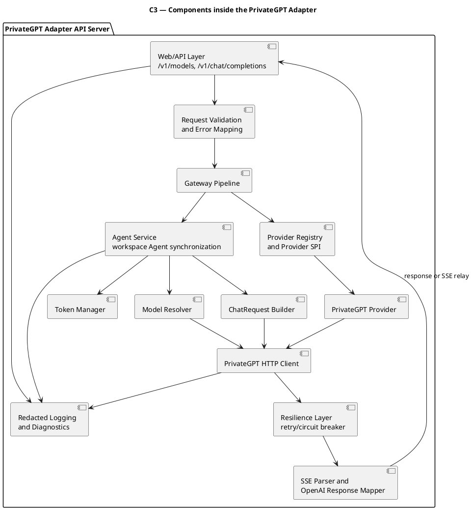

# Kiến trúc C4 — OpenCode PrivateGPT Bridge MVP

## Mục đích

Mô tả các boundary, container, component và luồng tích hợp bền vững của OpenCode PrivateGPT Bridge MVP. C4 này là kiến trúc mục tiêu để định hướng code, contract, kiểm thử và vận hành; nó không tự động khẳng định mọi component đã được triển khai.

## Phạm vi và nguyên tắc

- OpenCode là coding agent runtime duy nhất: quản lý workspace, file operation, command execution và approval.
- OpenCode PrivateGPT Bridge là dịch vụ Python local, mặc định bind `127.0.0.1`, expose API OpenAI-compatible và không thực thi tool.
- PrivateGPT Agent API là bắt buộc; adapter đồng bộ Agent theo workspace rồi đưa `metadata.agent_id` vào request hội thoại.
- Provider SPI là boundary giữa lớp nghiệp vụ adapter và nhà cung cấp cụ thể.
- MVP chỉ hỗ trợ `gemini-2.5-pro`; không có model fallback hoặc LiteLLM runtime bắt buộc.

## Phong cách kiến trúc

Kiến trúc mục tiêu là **Embedded AI Gateway Architecture**: một **modular monolith** chạy trong một process Python trên máy developer, kết hợp console runtime, embedded web server, gateway/proxy và streaming relay. Đây không phải microservices trong MVP.

Lựa chọn single-process giảm IPC nội bộ, latency và độ phức tạp debug cho luồng streaming. Các layer bên trong phải vẫn tách module rõ ràng để có thể mở rộng Provider SPI hoặc tách deployment trong tương lai khi có nhu cầu đã được quyết định.

## C1 — System Context

### Mã PlantUML (PUML)

| Thành phần | Vai trò | Boundary chính |
|---|---|---|
| Developer | Khởi tạo login, cấu hình OpenCode và phê duyệt tác vụ có tác động. | Không gọi PrivateGPT internal API trực tiếp. |
| OpenCode CLI | Client chính của MVP và owner duy nhất của coding workflow. | Không quản lý PrivateGPT token, Agent API hoặc SSE mapping. |
| OpenCode PrivateGPT Bridge | Translation/integration boundary giữa OpenCode và PrivateGPT. | Không đọc/sửa file hoặc chạy command/tool. |
| PrivateGPT Platform | Cung cấp Agent API, Conversation API và model discovery. | Không thực hiện quyền thao tác workspace local. |
| Gemini 2.5 Pro | Model duy nhất được expose trong MVP. | Không được fallback sang model khác khi không khả dụng. |

## C2 — Containers và deployment

### Mã PlantUML (PUML)

| Container/ranh giới deploy | Công nghệ/kiểu | Trách nhiệm | In/Out |
|---|---|---|---|
| Embedded Python Application | Một process Python modular monolith | Chứa Console Runtime, FastAPI/ASGI server, gateway/proxy, streaming relay và adapter modules. | Nhận request OpenCode local; gọi PrivateGPT qua HTTPS. |
| Console Runtime | Python CLI bên trong embedded application | Khởi động/dừng process, login/logout, status, agent sync/status/reset, doctor và hint cấu hình OpenCode. | Điều khiển lifecycle local; không gửi chat thay OpenCode. |
| Embedded Web Server | FastAPI/ASGI bên trong process | Expose health/OpenAI-compatible interface và quản lý HTTP/SSE lifecycle. | Không chứa provider-specific API logic. |
| Gateway & Streaming Proxy | Pipeline nội bộ trong process | Validate, enrich, route, apply timeout/retry/circuit breaker, relay stream và map errors. | Không thực thi tool hoặc truy cập workspace. |
| Token Store | Cơ chế lưu bảo mật của hệ điều hành hoặc được quyết định trước pilot | Lưu refresh token; access token chỉ được cache in-memory theo requirement. | Không log hay trả token ra API. |
| Workspace Agent Cache | Local metadata store | Lưu `agent_id`, `model_id`, `instructions_hash`, `updated_at` để tránh tạo Agent mỗi request. | Không lưu toàn bộ lịch sử chat trong MVP. |
| PrivateGPT Platform | Hệ thống bên ngoài | Cấp model, quản lý Agent và tạo response hội thoại/SSE. | Internal API contract cần runtime evidence xác nhận. |

## C3 — Components bên trong Adapter API Server

### Mã PlantUML (PUML)

| Component | Trách nhiệm | Không được làm |
|---|---|---|
| Embedded Web/API Layer | Expose `/v1/models` và `/v1/chat/completions`; quản lý HTTP/SSE lifecycle và trả lỗi theo contract OpenAI-compatible trong phạm vi MVP. | Gọi trực tiếp concrete provider mà bỏ qua Provider SPI. |
| Gateway Pipeline | Điều phối `validate → enrich → route → execute → relay → finalize`; áp cross-cutting concern trước/sau provider call. | Trở thành một service deploy độc lập hoặc thực thi tool/workspace action. |
| Request Validation & Error Mapping | Validate model/request, map lỗi auth/model/Agent/SSE thành lỗi adapter rõ ràng. | Lộ token, cookie hoặc raw source code trong lỗi/log. |
| Agent Service | Đảm bảo Agent tồn tại, xây dựng instruction tương thích OpenCode, update khi model hoặc instruction hash đổi. | Fallback âm thầm sang inline instruction khi Agent sync thất bại. |
| Provider Registry & Provider SPI | Resolve provider từ model-qualified name và giữ Agent/API layer độc lập provider cụ thể. | Chứa logic HTTP/auth riêng của PrivateGPT. |
| PrivateGPT Provider | Triển khai mapping PrivateGPT: auth session, Agent, Conversation, streaming. | Tự retry, tự quản lý circuit breaker hoặc tự thực thi tool. |
| Model Resolver | Map public alias `gemini-2.5-pro` sang internal model ID được phát hiện/cấu hình. | Fallback sang model khác. |
| Token Manager | Thực hiện browser-login state, secure-store access, refresh trước expiry và retry 401 một lần theo requirement. | Persist token plaintext hoặc in token vào log. |
| ChatRequest Builder | Render message OpenCode, dựng PrivateGPT request với `metadata.agent_id`, model ID và `tools: []`. | Bỏ system/developer messages. |
| SSE Parser & Response Mapper | Thu visible content, lọc marker nội bộ, dừng đúng sự kiện, tạo OpenAI-compatible response. | Thực thi `<tool_call>` hoặc return tool call như hành động đã thực thi. |
| Resilience Layer | Áp retry/circuit breaker bên ngoài Provider theo architecture appendix. | Nuốt lỗi để che giấu tình trạng PrivateGPT. |
| PrivateGPT HTTP Client | Dùng `AsyncClient` dùng chung để gọi PrivateGPT với timeout/connection limits. | Gắn business/Agent policy vào transport client. |
| Redacted Logging & Diagnostics | Ghi request ID, latency, status, endpoint, provider và thông tin chẩn đoán an toàn. | Ghi token, cookie, password, prompt nhạy cảm hoặc raw source code. |

## Mô hình streaming

Streaming là luồng runtime quan trọng của gateway, nhưng không phải một container hay service riêng trong MVP. PrivateGPT Provider đọc SSE từ PrivateGPT; Gateway Pipeline và SSE Parser chuẩn hóa/chuyển tiếp incremental content về OpenCode qua HTTP streaming khi OpenCode yêu cầu.

MVP không cam kết WebSocket. WebSocket, backpressure policy chi tiết, cancel-generation protocol và external HTTP clients ngoài OpenCode chỉ được thêm khi request capture hoặc một quyết định kiến trúc xác nhận cần thiết.

## Luồng quan trọng

### Login và token lifecycle

1. Developer gọi `privategpt-adapter login`.
2. Adapter CLI mở browser login theo flow PrivateGPT và nhận callback local.
3. Token Manager lưu refresh token bằng secure store đã được chấp thuận, cache access token trong memory và kiểm tra hạn dùng.
4. Trước call PrivateGPT, Token Manager refresh token khi cần; HTTP 401 được refresh/retry tối đa một lần.
5. Nếu refresh không thành công, API trả trạng thái yêu cầu login thay vì sử dụng token không hợp lệ.

### Chat completion qua Agent Mode

1. OpenCode gọi Adapter API tại `/v1/chat/completions` với `gemini-2.5-pro`.
2. API Layer validate model và Token Manager đảm bảo login hợp lệ.
3. Agent Service resolve internal model ID rồi tìm/tạo/update Agent theo workspace.
4. ChatRequest Builder render OpenCode messages và gắn `metadata.agent_id`.
5. Gateway Pipeline resolve `PrivateGPTProvider` qua Provider SPI; provider gọi Conversation API qua HTTP Client.
6. SSE Parser thu response; Gateway Streaming Proxy relay incremental content hoặc Response Mapper trả response OpenAI-compatible cho OpenCode.
7. OpenCode tự quyết định thao tác tiếp theo và hỏi developer nếu cần edit hoặc chạy command.

## Boundary và chính sách phụ thuộc

| Boundary | Quy tắc |
|---|---|
| OpenCode ↔ Adapter | Chỉ giao tiếp qua local OpenAI-compatible HTTP interface. Adapter không phụ thuộc IntelliJ runtime. |
| Console Runtime ↔ Web Server ↔ Gateway | Cùng một Python process, giao tiếp bằng module/function call nội bộ; không phát sinh HTTP/IPC nội bộ. |
| API Layer ↔ Provider | API Layer phụ thuộc Provider SPI, không phụ thuộc `PrivateGPTProvider` trực tiếp. |
| Agent Service ↔ Provider | Agent Service dùng contract Unified request/response; provider-specific API nằm trong Provider implementation. |
| Adapter ↔ PrivateGPT | Chỉ HTTP internal API có Bearer token; request/response schema cần runtime capture để xác nhận trước pilot. |
| Adapter ↔ Workspace | Không có direct filesystem, shell, tool executor hoặc quyền approval trong adapter. |
| Token ↔ Logging | Token/cookie/password không được đi vào log, API response hoặc diagnostic output. |

## Điều chỉnh theo draft kiến trúc

`../01-requirements/00.achieteture_idea_v3.md` là phụ lục architecture-design đã công bố, xác nhận phong cách embedded gateway, pipeline streaming và lý do không tách microservice. Những nội dung sau được giữ ngoài scope MVP hoặc cần quyết định/evidence bổ sung: WebSocket endpoint, external HTTP client không phải OpenCode, event bus, Redis/cache phân tán, multi-model routing và tách adapter thành service riêng.

## Hiện trạng implementation quan sát được

Implementation hiện tại có các boundary C3 chính. Bảng này là inventory code, không phải bằng chứng của OpenCode hoặc PrivateGPT runtime pilot:

| Vùng source | Evidence quan sát | Đánh giá so với kiến trúc mục tiêu |
|---|---|---|
| `src/main.py`, `src/api/router.py` | Compose FastAPI, expose `/health`, `/v1/models`, `/v1/chat/completions`, local API-key validation và typed bridge errors. | Khớp API layer; `/auth/*` và lifecycle HTTP vẫn chưa được triển khai. |
| `src/services/gateway.py` | Validate model/tool boundary, preserve caller messages, ensure Agent, route qua Provider SPI, map non-stream và OpenAI SSE. | Khớp Gateway Pipeline cho confirmed text flow; retry/circuit breaker và disconnect observation cần evidence riêng. |
| `src/services/agent_service.py` | Builds/hashes fixed OpenCode-compatible Agent instructions and caches binding theo workspace/model/hash. | Khớp Agent Service; cache đang in-memory, không phải persistent workspace cache. |
| `src/providers/spi.py`, `src/providers/registry.py` | API/service layer depends on Provider SPI and registry. | Khớp dependency direction; MVP chỉ đăng ký `PrivateGPTProvider`. |
| `src/providers/privategpt.py`, `src/clients/http.py` | Calls observed PrivateGPT model, Agent and Conversation endpoints; maps SSE `data` and `DONE`; uses async HTTP. | Khớp confirmed plugin evidence, nhưng real Agent/model/SSE schemas và OAuth refresh still require redacted runtime capture. |
| `src/config/settings.py`, `src/auth/token_manager.py` | Loopback-safe configuration and in-memory access-token holder. | Secure refresh-token store/browser OAuth are not implemented because approved token-store and OAuth callback contract are still open. |
| `tests/unit/` | Unit tests cover message preservation, tool rejection and observed upstream endpoint/payload mapping using synthetic HTTP fixtures. | Unit evidence exists; integration, runtime smoke and OpenCode pilot remain required. |

Trạng thái drift: `partially_synced`. Code now implements the confirmed local API, Provider SPI, Agent, mapping and SSE boundaries, while official requirements remain ahead for browser OAuth, approved secure-token persistence, refresh/retry policy, persistent Agent metadata, diagnostics and real-client compatibility evidence.

## Traceability và quyết định còn cần thiết

| Chủ đề | Artefact hiện có | Cần làm tiếp |
|---|---|---|
| Tầm nhìn | `03.vision.md` | Đã liên kết. |
| Thuật ngữ | `02.glossary.md` | Đã liên kết. |
| NFR | `05.nfr.md` | Cần thay khung generic bằng NFR cụ thể cho auth, redaction, timeout, localhost và reliability. |
| ADR | `06.adr.md` | Cần ghi các quyết định về token store, session/model resolution, streaming và Provider SPI khi có evidence/decision. |
| BPMN/use cases | Template hiện hữu | Cần mô hình hóa login, agent sync, chat và pilot. |
| API contract/tests | Application spec, OpenAPI, BDD và focused unit tests tồn tại. | Cần integration fixtures, runtime smoke và redacted OpenCode/PrivateGPT captures trước pilot. |

## Kiểm chứng

Kiểm chứng C4 bằng cách đối chiếu mỗi boundary với requirement và business requirements, review dependency direction trong code, kiểm tra provider-specific API không rò vào API/Agent layer, và chạy smoke/pilot evidence theo QA Matrix. Khi có thay đổi container, component, dependency hoặc runtime flow, cập nhật C4 trước hoặc cùng thay đổi implementation.

## Ghi chú thay đổi

- 2026-06-22: Thay khung C4 generic bằng kiến trúc mục tiêu OpenCode PrivateGPT Bridge MVP; bổ sung C1, C2, C3, boundary, luồng Agent Mode và đánh giá docs-ahead-of-code.
- 2026-06-23: Đồng bộ source hierarchy với Vision, Glossary và published architecture-design appendix; sửa liên kết design input đã di chuyển.
- 2026-06-23: Bổ sung mã PlantUML cho ba diagram C4 (context, containers và components).
- 2026-06-23: Reconciled the implementation inventory with the current `src/` layout and recorded the remaining runtime-evidence and security gaps.
