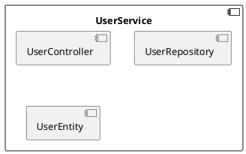

# HƯỚNG DẪN TRIỂN KHAI NHANH: AGENTIC SOFTWARE ENGINEERING + SPEC-FIRST GenAI SDLC

## Purpose

This document preserves the existing content of `docs/methodology/methodology.md` and connects it to the repository documentation graph for Agentic Spec First work.

> Tham khảo và thực hiện để tăng tốc phát triển phần mềm hiện đại với bất kỳ tech stack và loại ứng dụng nào:
> - **Web Applications**: REST APIs, SPAs, Full-stack apps
> - **Desktop Applications**: GUI apps (Windows, macOS, Linux)
> - **Application Interfaces / Tools / Jobs**: local tools, batch processors, daemons, workers, libraries
> - **Mobile Applications**: Native hoặc cross-platform
> 
> Sử dụng AI (Cursor IDE, ChatGPT Plus, Claude) với bất kỳ ngôn ngữ nào (Python, Java, Node.js, .NET, C++, Rust, Go, etc.)

---

## Cách dùng bộ tài liệu đi kèm

Tài liệu này là **nguồn phương pháp luận tổng thể** cho workflow Spec-First + Agentic Development.

Để triển khai thực tế theo đúng thứ tự artifact, đọc thêm:

- [knowledge_base.md](./knowledge_base.md): bản đồ 21 nhóm kiến thức nền và roadmap nắm bắt, triển khai SDD end to end.
- [d_3.document_strategy_and_creation_order.md](./d_3.document_strategy_and_creation_order.md): mô tả cần tạo tài liệu nào, theo thứ tự nào, và tài liệu nào phụ thuộc tài liệu nào.
- [d_1.quickstarts.md](./d_1.quickstarts.md): playbook triển khai nhanh theo sprint đầu hoặc 7 ngày khởi động.

Quy ước dùng chung trong bộ tài liệu:

- **Canonical API contract path**: `docs/04-spec-test/10.openapi.yaml`
- Nếu gặp `docs/04-spec-test/01-10.openapi.yaml` trong tài liệu cũ, hiểu đó là legacy alias của cùng một loại artifact.

---

## 1. Tư duy tổng quan

- **Spec-First & Agentic Development:** Mọi code, test, tài liệu đều lấy đặc tả làm "ground truth". AI cần các tài liệu mô tả rõ ràng, có cấu trúc để hiểu và generate code chính xác. Dưới đây là hướng dẫn chi tiết cách tạo từng loại tài liệu:

  - **ADR (Architecture Decision Records)**: Ghi lại quyết định kiến trúc, giúp AI hiểu lý do đằng sau các lựa chọn
    - **Cấu trúc**: Markdown với format chuẩn: `# ADR-XXX: [Title]` → `## Context` → `## Decision` → `## Consequences` → `## Status`
    - **Ví dụ**: `docs/02-architecture/06.adr.md` hoặc `docs/02-architecture/adr/001-choose-spring-boot.md`
    - **Template**: [ADR Template](https://github.com/npryce/adr-tools/blob/master/doc/adr-template.md)
    - **Lưu ý**: Mỗi ADR phải có ID duy nhất, status (Proposed/Accepted/Deprecated), và giải thích rõ trade-offs

  - **UML/C4 Diagrams**: Mô hình hóa kiến trúc và design, AI có thể đọc và hiểu structure
    - **C4 Model**: Text-based với PlantUML hoặc Mermaid format
    - **Cấu trúc**: Context → Container → Component → Code (4 levels)
    - **Format**: `docs/C4_Context.puml`, `docs/C4_Container.puml`, `docs/C4_Component.puml`
    - **Ví dụ PlantUML**: `@startuml` → `component [Name]` → `[Name] --> [Other]` → `@enduml`
    - **Lưu ý**: Dùng text-based format (PlantUML/Mermaid) thay vì PNG để AI có thể parse

  - **Gherkin (BDD)**: Mô tả behavior dạng tự nhiên, AI generate test cases chính xác
    - **Cấu trúc**: `Feature:` → `Scenario:` → `Given/When/Then/And/But`
    - **Format**: `docs/test-cases.md` hoặc `docs/features/*.feature`
    - **Ví dụ**:
      ```gherkin
      Feature: User Registration
        Scenario: Successful registration
          Given a new user with email "test@example.com"
          When the user submits registration form
          Then the user should be created in database
          And a confirmation email should be sent
      ```
    - **Lưu ý**: Dùng ngôn ngữ tự nhiên, tránh technical jargon, mỗi scenario test 1 behavior

  - **DDD (Domain-Driven Design)**: Bounded contexts, entities, value objects giúp AI hiểu domain model
    - **Cấu trúc**: Markdown với sections: Bounded Contexts → Entities → Value Objects → Aggregates → Repositories
    - **Format**: `docs/02-architecture/02.glossary.md`
    - **Ví dụ**:
      ```markdown
      ## Bounded Context: Order Management
      ### Entities
      - Order (Aggregate Root)
        - OrderId (Value Object)
        - OrderItems (Collection)
      ### Value Objects
      - Money (amount, currency)
      ```
    - **Lưu ý**: Phân biệt rõ Entity (có identity) vs Value Object (không có identity), xác định Aggregate Root

  - **OpenAPI/Schema**: Contract specification, AI generate API code đúng chuẩn (cho web apps)
    - **Cấu trúc**: YAML/JSON với format OpenAPI 3.x: `openapi: 3.0.0` → `info:` → `paths:` → `components:`
    - **Format**: `docs/04-spec-test/10.openapi.yaml`
    - **Required sections**: `paths`, `components/schemas`, `components/responses`
    - **Lưu ý**: Phải có đầy đủ request/response schemas, validation rules, error responses
    - **Tool**: Dùng [Swagger Editor](https://editor.swagger.io/) để validate

  - **Application Interface Specification**: Contract mô tả cách người dùng, hệ thống khác, job, API, UI, hoặc local tool tương tác với ứng dụng.
    - **Cấu trúc**: YAML hoặc Markdown. Chọn trường phù hợp với loại interface: operations, routes, screens, events, commands, inputs, outputs, status/result codes, error behavior.
    - **Format**: `docs/04-spec-test/application-spec.yaml` hoặc `docs/04-spec-test/application-spec.md`
    - **YAML example (local-tool variant)**:
      ```yaml
      interfaces:
        - name: process-file
          kind: local-tool
          description: Process files
          inputs: [{name: input, type: string, required: true}]
          configuration: [{name: output, type: string, required: false}]
          result_codes: {success: Completed, invalid_input: Invalid input}
      ```
    - **Lưu ý**: Với command-oriented tools, định nghĩa rõ argument types, required/optional, exit codes, output formats. Với API/UI/job/library, thay bằng request/response, event, screen flow, schedule, hoặc function contract tương ứng.

  - **UI/UX Mockups**: Wireframes, design specs (cho desktop/mobile apps)
    - **Cấu trúc**: Markdown với sections: Screen Layout → Components → User Interactions → Data Binding
    - **Format**: `docs/04-spec-test/ui-spec.md` + `docs/04-spec-test/mockups/*.png` (nếu có)
    - **Ví dụ**:
      ```markdown
      ## Screen: User Management
      ### Layout: Header (Title, Search, Add Button) | Main (Table) | Footer (Pagination)
      ### Components: UserTable, SearchBar, AddUserDialog
      ### Interactions: Click Add → Open Dialog, Click Edit → Load Data
      ### Data Binding: UserTable.dataSource → List<User>
      ```
    - **Lưu ý**: Mô tả rõ component hierarchy, event flow, data binding relationships

  - **BPMN**: Mô hình quy trình nghiệp vụ, AI hiểu business flow
    - **Cấu trúc**: XML (BPMN 2.0) hoặc diagram tools (Camunda, Signavio)
    - **Format**: `docs/04-spec-test/process-order.bpmn` hoặc `docs/04-spec-test/process-order.png`
    - **Elements**: Start Event → Tasks → Gateways (Decision) → End Event
    - **Lưu ý**: Dùng cho quy trình phức tạp với nhiều bước, conditions, parallel flows
    - **Tool**: [Camunda Modeler](https://camunda.com/products/camunda-platform/modeler/) hoặc online BPMN editors

  - **Coding Standards**: Style guide, naming conventions giúp AI generate code nhất quán
    - **Cấu trúc**: Markdown với sections: Naming Conventions → Code Style → Best Practices → Examples
    - **Format**: `docs/02-architecture/08.standards.md`
    - **Nội dung**: 
      - Naming: classes, methods, variables, constants
      - Code style: indentation, line length, comments
      - Best practices: error handling, logging, testing
      - Examples: Good vs Bad code samples
    - **Lưu ý**: Tham khảo official style guides (PEP8, Google Java Style, etc.) và customize cho team

- **AI-Driven Scaffold & Dev:** Sử dụng AI (Cursor IDE, ChatGPT, Claude, v.v.) để sinh mã, test, seed dữ liệu, tài liệu vận hành; human focus vào verify, kiến trúc hóa, review. AI hoạt động tốt nhất khi có đầy đủ context từ các tài liệu mô tả trên.

- **Agentic Workflow - Multi-Model Strategy:** Phối hợp 4 model AI theo từng phase:
  - **R&D & Strategy** → ChatGPT 5.1 (research, solution options)
  - **Planning & Architecture** → Claude Sonnet 4.5 (deep thinking, system design)
  - **Rapid Implementation** → Composer1 trong Cursor IDE (fast code generation)
  - **Debugging & Refinement** → GPT-5.1-Codex (minimal fixes, production-ready)

---

## 2. Lộ trình triển khai thực tiễn (7 ngày khởi động chuẩn hóa)

### **Ngày 1–2: Chuẩn hóa kiến trúc & guardrails**
  - [ ] Vẽ/Cập nhật sơ đồ kiến trúc hệ thống (C4, UML, có thể dùng diagram PNG/PlantUML/Mermaid).
  - [ ] Ghi nhận ADR (kiểu [mẫu này](https://github.com/npryce/adr-tools/blob/master/doc/adr-template.md)) - **Quan trọng**: AI cần ADR để hiểu quyết định kiến trúc.
  - [ ] Viết chuẩn code (`docs/02-architecture/08.standards.md`):
    - **Python**: PEP8, Black, Flake8
    - **Java**: Google Java Style, Checkstyle
    - **Node.js**: ESLint, Prettier
    - **.NET**: StyleCop, EditorConfig
    - Naming rules, convention team cho tech stack của bạn
  - [ ] Tạo `docs/06-quality-assurance/13.prompt-guardrails.md`: quy tắc kiểm soát AI/codegen (sample dưới).

### **Ngày 3: Đặc tả & contract-first hóa**

**Theo loại ứng dụng**:

**Web Applications**:
  - [ ] Khai báo OpenAPI/JSON-Schema đặc tả nghiệp vụ chính (`docs/04-spec-test/10.openapi.yaml`) - **Quan trọng**: AI dùng OpenAPI để generate API code.

**Application Interfaces / Local Tools / Jobs**:
  - [ ] Định nghĩa application interface specification (`docs/04-spec-test/application-spec.md` hoặc `docs/04-spec-test/application-spec.yaml`):
    - Operations, routes, screens, events, jobs, commands, hoặc function entry points
    - Inputs, outputs, required/optional fields, và config behavior
    - Status/result codes, error handling, logging/output format khi có
    - Runtime assumptions và verification examples
  - **Quan trọng**: AI dùng application spec để generate đúng interface code cho loại ứng dụng đã chọn, không mặc định là application interface/tool/job.

**Desktop Applications**:
  - [ ] Tạo UI/UX specifications (`docs/04-spec-test/ui-spec.md` hoặc mockups):
    - Screen layouts và navigation flow
    - Component hierarchy
    - User interactions
    - Data binding requirements
  - **Quan trọng**: AI dùng UI spec để generate GUI code.

**Chung cho mọi loại ứng dụng**:
  - [ ] Tạo `docs/02-architecture/02.glossary.md` (từ điển nghiệp vụ, bounded context DDD) - **Quan trọng**: AI cần hiểu domain model.
  - [ ] Định nghĩa test-case chính theo **Gherkin (BDD)** hoặc bảng test (bắt đầu với 1–2 feature core) - **Quan trọng**: Gherkin giúp AI generate test cases chính xác.
  - [ ] Vẽ BPMN cho quy trình nghiệp vụ phức tạp (nếu có) - **Quan trọng**: AI hiểu business flow.

### **Ngày 4–5: Gen code skeleton & test với AI**

**Theo loại ứng dụng**:

**Web Applications**:
  - [ ] Yêu cầu AI tạo code scaffold/module dựa trên tech stack đã chọn:
    - **Python**: FastAPI/Flask/Django
    - **Java**: Spring Boot, Quarkus
    - **Node.js**: Express, NestJS, Fastify
    - **.NET**: ASP.NET Core, Minimal API
    - Dựa trên **OpenAPI spec** và coding standards

**Application Interfaces / Tools / Jobs**:
  - [ ] Yêu cầu AI tạo application scaffold dựa trên application spec:
    - **Python**: Click, argparse, Typer
    - **Java**: Picocli, JCommander
    - **Node.js**: Commander.js, yargs
    - **.NET**: System.CommandLine
    - **Go**: Cobra, urfave command package
    - **Rust**: clap
    - Dựa trên **application interface specification** và coding standards

**Desktop Applications**:
  - [ ] Yêu cầu AI tạo GUI scaffold dựa trên UI spec:
    - **Python**: Tkinter, PyQt, PySide, Kivy
    - **Java**: JavaFX, Swing
    - **.NET**: WPF, WinForms, MAUI
    - **C++**: Qt, wxWidgets
    - **Electron**: Cho cross-platform desktop apps
    - Dựa trên **UI/UX specifications** và coding standards

**Chung cho mọi loại ứng dụng**:
  - [ ] Sinh test/unit test cho từng scenario trong Gherkin/test-cases:
    - **Python**: pytest, unittest
    - **Java**: JUnit, TestNG
    - **Node.js**: Jest, Mocha
    - **.NET**: xUnit, NUnit
    - **C++**: Google Test, Catch2
    - **Go**: testing package
    - **Rust**: built-in test framework
  - [ ] Nếu dùng DB, sinh migration/schema, seed fixture mẫu:
    - **Python**: Alembic, SQLAlchemy migrations
    - **Java**: Flyway, Liquibase
    - **Node.js**: Knex, TypeORM migrations
    - **.NET**: EF Core migrations
    - **Go**: golang-migrate, sql-migrate

### **Ngày 6–7: Thiết lập Dev Loop, CI & quy trình kiểm thử**
  - [ ] Tạo workflow CI (Github Actions/GitLab CI):
    - Lint: ESLint/Checkstyle/StyleCop/Flake8
    - Test: Jest/JUnit/xUnit/pytest
    - Contract test: Dredd, Schemathesis, Pact
  - [ ] Bổ sung các module hỗ trợ (logging, error handling, common libs) nếu cần – có thể dùng AI gen từng khối nhỏ.
  - [ ] Hướng dẫn sinh auto-doc, runbook dựa trên đặc tả và test-case.

---

## 3. Checklist tệp nền tảng cần tạo

**Chung cho mọi loại ứng dụng**:
- `docs/C4_Context.png` hoặc `docs/C4_Context.puml` — sơ đồ kiến trúc hệ thống
- `docs/02-architecture/06.adr.md` — decision record (lập mẫu)
- `docs/02-architecture/08.standards.md` — chuẩn code (theo tech stack)
- `docs/06-quality-assurance/13.prompt-guardrails.md` — định nghĩa rule AI/codegen
- `docs/02-architecture/02.glossary.md` — từ điển nghiệp vụ (DDD)
- `docs/test-cases.md` — kịch bản/bảng test đầu tiên (dùng Gherkin, table, checklist)
- `docs/prompt.md` — prompt nền tảng sử dụng cho AI (copy-paste vào ChatGPT/Cursor)
- `src/` — folder code (theo tech stack)
- `tests/` — folder code test
- `.github/workflows/` — workflow CI (yaml)

**Theo loại ứng dụng**:

**Web Applications**:
- `docs/04-spec-test/10.openapi.yaml` — mô tả API/contract

**Application Interfaces / Tools / Jobs**:
- `docs/04-spec-test/application-spec.md` hoặc `docs/04-spec-test/application-spec.yaml` — application interface specification

**Desktop Applications**:
- `docs/04-spec-test/ui-spec.md` — UI/UX specifications
- `docs/04-spec-test/mockups/` — UI mockups (nếu có)

---

## 3b. Tài liệu mô tả để AI hiểu được - Quan trọng! 📚

**Nguyên tắc**: AI cần các tài liệu mô tả rõ ràng, có cấu trúc để hiểu và generate code chính xác. Các tài liệu này là "ngôn ngữ chung" giữa human và AI.

### ADR (Architecture Decision Records)

**Mục đích**: Ghi lại quyết định kiến trúc, giúp AI hiểu **TẠI SAO** chọn solution này thay vì solution khác.

**Format**: Markdown với structure:
- Context: Tình huống cần quyết định
- Decision: Quyết định đã chọn
- Consequences: Hậu quả (tích cực và tiêu cực)

**Ví dụ**: `docs/02-architecture/06.adr.md`
```markdown
# ADR-001: Chọn Spring Boot thay vì Quarkus

## Context
Cần framework Java cho microservices, team đã quen Spring Boot.

## Decision
Chọn Spring Boot 3.x với Spring Cloud.

## Consequences
- ✅ Team productivity cao (đã quen)
- ✅ Ecosystem lớn, nhiều libraries
- ❌ Startup time chậm hơn Quarkus
```

**AI sử dụng**: Khi generate code, AI sẽ tuân thủ quyết định trong ADR, không đề xuất solution khác.

### UML/C4 Diagrams

**Mục đích**: Mô hình hóa kiến trúc và design, AI có thể **ĐỌC** và hiểu structure.

**Các loại diagram**:
- **C4 Model**: Context, Container, Component, Code
- **UML Class Diagram**: Entities, relationships
- **Sequence Diagram**: Flow giữa các components
- **PlantUML/Mermaid**: Text-based, AI có thể parse

**Ví dụ**: `docs/C4_Component.puml`


**AI sử dụng**: AI đọc diagram và generate code structure tương ứng.

### Gherkin (BDD - Behavior-Driven Development)

**Mục đích**: Mô tả behavior dạng tự nhiên, AI generate test cases chính xác.

**Format**: Given-When-Then
```gherkin
Feature: User Registration
  Scenario: Successful registration
    Given a new user with email "test@example.com"
    When the user submits registration form
    Then the user should be created in database
    And a confirmation email should be sent
```

**AI sử dụng**: AI đọc Gherkin và generate test code tương ứng:
- **Python**: pytest với pytest-bdd
- **Java**: Cucumber với JUnit
- **Node.js**: Cucumber.js với Jest
- **.NET**: SpecFlow với xUnit

**Ví dụ output từ AI**:
```python
# Python/pytest
def test_successful_registration():
    # Given
    email = "test@example.com"
    # When
    result = register_user(email)
    # Then
    assert user_exists_in_db(email)
    assert confirmation_email_sent(email)
```

### DDD (Domain-Driven Design)

**Mục đích**: Bounded contexts, entities, value objects giúp AI hiểu domain model.

**Các khái niệm chính**:
- **Bounded Context**: Phạm vi domain
- **Entity**: Object có identity
- **Value Object**: Object không có identity
- **Aggregate**: Nhóm entities liên quan
- **Repository**: Interface truy cập data

**Ví dụ**: `docs/02-architecture/02.glossary.md`
```markdown
## Bounded Context: Order Management

### Entities
- Order (Aggregate Root)
  - OrderId (Value Object)
  - OrderItems (Collection)
  - CustomerId
  - Status

### Value Objects
- Money (amount, currency)
- Address (street, city, zip)

### Repositories
- IOrderRepository
```

**AI sử dụng**: AI hiểu domain model và generate code đúng với DDD patterns:
- **Java/Spring**: Entities với JPA, Repositories
- **.NET**: Entities với EF Core, Repository pattern
- **Node.js**: Domain models, Repository interfaces

### OpenAPI/Schema

**Mục đích**: Contract specification, AI generate API code đúng chuẩn.

**Format**: YAML/JSON
```yaml
paths:
  /users:
    post:
      requestBody:
        content:
          application/json:
            schema:
              type: object
              properties:
                email:
                  type: string
                  format: email
```

**AI sử dụng**: AI đọc OpenAPI và generate:
- **API Controllers/Routes**: Spring Boot, Express, ASP.NET Core
- **DTOs/Models**: Request/Response objects
- **Validation**: Annotations/attributes
- **Client SDKs**: TypeScript, Python, Java

### Application Interface Specification

**Mục đích**: Định nghĩa application interface để AI generate code đúng contract cho API, UI action, job, library, local tool, hoặc command-oriented app.

**Format**: Markdown hoặc YAML
```yaml
# docs/04-spec-test/application-spec.yaml
interfaces:
  - name: process-file
    kind: local-tool
    description: Process files
    inputs:
      - name: input
        type: string
        required: true
        description: Input file path
    configuration:
      - name: output
        type: string
        description: Output file path
      - name: verbose
        type: boolean
        default: false
    result_codes:
      success: Completed successfully
      invalid_input: Input validation failed
      processing_failed: Processing failed after validation
    output_format: json|yaml|text|table
```

**Hoặc Markdown**:
```markdown
# Application Interface Specification

## Interface: process-file

**Description**: Process files

**Invocation**: local tool command, scheduled job, service method, or UI action depending on project type

**Inputs**:
- `input` (required): Input file path

**Configuration**:
- `output`: Output file path
- `verbose`: Enable verbose logging

**Result Codes**:
- `success`: Completed successfully
- `invalid_input`: Input validation failed
- `processing_failed`: Processing failed after validation

**Output Format**: JSON, YAML, text, or table
```

**AI sử dụng**: AI đọc application spec và generate:
- **Interface adapters**: API routes, UI handlers, scheduled jobs, library functions, or command parsers when the selected app type needs them
- **Input validation**: Type checking, required/optional handling
- **User/system feedback**: Help text, UI validation, API errors, logs, or job reports as appropriate
- **Error handling**: Result codes, exceptions, response errors, exit codes, and redacted logs

### UI/UX Specification (cho Desktop/Mobile Applications)

**Mục đích**: Định nghĩa giao diện người dùng, AI generate GUI code đúng design.

**Format**: Markdown với mô tả chi tiết hoặc kèm mockups
```markdown
# UI Specification

## Screen: User Management

### Layout
- Header: Title "User Management", Search bar, Add button
- Main area: Table với columns (Name, Email, Role, Actions)
- Footer: Pagination controls

### Components
- UserTable: Hiển thị danh sách users
- SearchBar: Filter users theo name/email
- AddUserButton: Mở dialog thêm user
- EditUserButton: Mở dialog edit user
- DeleteUserButton: Xác nhận và xóa user

### User Interactions
- Click Add button → Mở AddUserDialog
- Click Edit button → Mở EditUserDialog với user data
- Click Delete button → Show confirmation → Delete user
- Type in SearchBar → Filter table realtime

### Data Binding
- UserTable.dataSource → List<User>
- SearchBar.text → Filter criteria
- Dialog fields → User entity properties
```

**Kèm mockups**: Nếu có, đặt trong `docs/04-spec-test/mockups/`

**AI sử dụng**: AI đọc UI spec và generate:
- **GUI Components**: Tkinter (Python), JavaFX/Swing (Java), WPF/WinForms/MAUI (.NET), Qt (C++), Electron (cross-platform)
- **Layout structure**: Window/Form structure, component hierarchy
- **Event handlers**: Button clicks, form submissions, navigation
- **Data binding**: Connect UI components với data models
- **Validation**: Input validation và error display

### BPMN (Business Process Model and Notation)

**Mục đích**: Mô hình quy trình nghiệp vụ, AI hiểu business flow.

**Khi nào dùng**: Quy trình phức tạp với nhiều bước, conditions, parallel flows.

**Ví dụ**: Order fulfillment process với approval workflow.

**AI sử dụng**: AI hiểu flow và generate:
- State machines
- Workflow orchestration code
- Event handlers
- Saga pattern cho distributed transactions

### Coding Standards

**Mục đích**: Style guide, naming conventions giúp AI generate code nhất quán.

**Ví dụ theo tech stack**:
- **Python**: PEP8, type hints, docstrings
- **Java**: Google Java Style, Checkstyle rules
- **Node.js**: ESLint config, Prettier
- **.NET**: StyleCop, EditorConfig

**AI sử dụng**: AI đọc coding standards và generate code đúng format, naming convention.

---

## 4. **Guardrails & Prompt mẫu cho AI (copy-paste dùng ngay)**

### guardrails.md (mẫu)
```
- Code/tài liệu/test mới phải bám đặc tả:
  * Web apps: docs/04-spec-test/10.openapi.yaml
  * Application interfaces / tools / jobs: docs/04-spec-test/application-spec.md hoặc application-spec.yaml
  * Desktop apps: docs/04-spec-test/ui-spec.md
- ADR: docs/02-architecture/06.adr.md (hiểu quyết định kiến trúc)
- DDD Glossary: docs/02-architecture/02.glossary.md (hiểu domain model)
- Coding Standards: docs/02-architecture/08.standards.md
- Không thêm nghiệp vụ bên ngoài hoặc tự chế unless được viết rõ trong đặc tả.
- Tất cả PR phải pass lint, unit test, contract test CI.
- Mỗi module nghiệp vụ đều traceable từ test-case và contract.
```

### prompt.md (template)
```
Bạn là agent developer. Mọi yêu cầu code/test đều phải tuân thủ:

**Tài liệu mô tả (chọn theo loại ứng dụng)**:
- Web apps: OpenAPI spec: docs/04-spec-test/10.openapi.yaml
- Application interfaces / tools / jobs: application spec: docs/04-spec-test/application-spec.md hoặc application-spec.yaml
- Desktop apps: UI spec: docs/04-spec-test/ui-spec.md

**Tài liệu chung**:
- ADR: docs/02-architecture/06.adr.md (hiểu quyết định kiến trúc)
- DDD Glossary: docs/02-architecture/02.glossary.md (hiểu domain model)
- Coding Standards: docs/02-architecture/08.standards.md
- Guardrails: docs/06-quality-assurance/13.prompt-guardrails.md
- Gherkin test cases: docs/test-cases.md (nếu có)

**Tech Stack & Loại ứng dụng**:
- Tech Stack: [Python/Java/Node.js/.NET/Go/Rust/C++ - chỉ định rõ]
- Loại ứng dụng: [Web/API/UI/Desktop/Mobile/Local tool/Job/Library - chỉ định rõ]
- Framework: [FastAPI/Spring Boot/Express/ASP.NET Core/Typer/Cobra/Tkinter/JavaFX/WPF/Qt - chỉ định rõ]

Nếu không rõ behavior/contract thì hỏi lại hoặc throw NotImplementedError/NotImplementedException. Không tự thêm nghiệp vụ ngoài đặc tả.

Nhiệm vụ: [ví dụ: 
- Web: Tạo skeleton FastAPI/Spring Boot/Express/ASP.NET Core dựa trên OpenAPI spec, sinh tests
- Application interface/tool/job: Tạo adapter phù hợp dựa trên application spec, sinh tests
- Desktop: Tạo GUI với Tkinter/JavaFX/WPF/Qt dựa trên UI spec, sinh tests
]
```

---

## 5. **Agentic Workflow: Phối hợp Multi-Model trong Cursor**

### 🎯 Chiến lược phối hợp Multi-Model

**Workflow tổng quan**: R&D & Strategy → Detailed Planning & Architecture → Implementation → Debugging & Refinement

```
    (ChatGPT 5.1)      (Sonnet 4.5)         (Composer1)      (GPT-5.1-Codex)
    Phase 0: R&D       Phase 1: Planning    Phase 2: Code    Phase 3: Debug
```

**Lưu ý**: Phase 0 (R&D) là optional, chỉ cần khi dự án mới chưa có định hướng rõ ràng. Nếu đã có tech stack và architecture pattern, có thể bắt đầu từ Phase 1.

### 👥 Chia vai AI theo từng giai đoạn

**Nguyên tắc**: Mỗi model AI đóng vai trò chuyên biệt trong vòng đời phát triển, tối ưu hóa điểm mạnh của từng model.

#### Vai trò và trách nhiệm

| Vai trò | Model | Nhiệm vụ chính | Kỹ năng đặc trưng |
|---------|-------|----------------|-------------------|
| **🔍 Researcher & Strategist** | ChatGPT 5.1 | R&D ban đầu: phân tích yêu cầu, xác định domain, solution, tech stack, quyết định kiến trúc tổng quan | Quick research, brainstorming, broad knowledge, fast iteration |
| **🧠 Planner & Architect** | Claude Sonnet 4.5 | Thiết kế kiến trúc chi tiết, phân tích hệ thống sâu, đưa ra quyết định kỹ thuật phức tạp | Deep thinking, system-level analysis, trade-off evaluation, architectural patterns |
| **⚡ Coder & Implementer** | Composer1 (Cursor) | Sinh code nhanh, implement features, scaffold boilerplate | Fast code generation, context-aware coding, multi-file editing |
| **🔧 Debugger & Refiner** | GPT-5.1-Codex | Fix bugs, optimize code, handle edge cases, production-ready fixes | Minimal fixes, root cause analysis, production debugging |

#### Workflow đầy đủ: R&D → Plan → Code → Test → Run → Review

**Vòng lặp phát triển với vai trò rõ ràng**:

0. **R&D** (ChatGPT 5.1 - Researcher) - **Giai đoạn mới**
   - Phân tích yêu cầu ban đầu
   - Xác định domain nghiệp vụ tổng quan
   - Đề xuất solution và tech stack phù hợp
   - Quyết định kiến trúc tổng quan và khung ứng dụng đơn giản
   - Tạo foundation document để chuyển cho Planner

1. **Plan** (Sonnet 4.5 - Planner)
   - Nhận foundation từ Researcher
   - Phân tích sâu và thiết kế architecture chi tiết
   - Đưa ra implementation roadmap cụ thể
   - Xác định dependencies và risks chi tiết

2. **Code** (Composer1 - Coder)
   - Implement theo plan từ Sonnet
   - Generate boilerplate và business logic
   - Tạo tests cơ bản

3. **Test** (Composer1 + Human)
   - Chạy tests, verify functionality
   - Phát hiện bugs và edge cases
   - Nếu có bug → chuyển sang Debugger

4. **Run** (Human + Composer1)
   - Chạy thử trong IDE
   - Quick smoke test
   - Nếu lỗi → chuyển sang Debugger

5. **Review** (Sonnet 4.5 - Reviewer hoặc Human)
   - Review architecture có đúng plan?
   - Review code quality, security
   - Nếu cần refactor lớn → quay lại Plan

**Lưu ý**: Mỗi phase có thể lặp lại nhiều lần cho đến khi đạt quality gate.

#### Sơ đồ chuyển giao giữa các vai trò

```
┌─────────────────────────────────────────────────────────────┐
│                    BẮT ĐẦU DỰ ÁN/FEATURE                     │
└──────────────────────┬──────────────────────────────────────┘
                       │
                       ▼
        ┌──────────────────────────────┐
        │  PHASE 0: R&D & STRATEGY     │
        │  🔍 Researcher (ChatGPT 5.1)  │
        │  - Phân tích yêu cầu         │
        │  - Xác định domain & solution │
        │  - Tech stack & khung tổng quan│
        └──────────────┬───────────────┘
                       │
                       ▼
        ┌──────────────────────────────┐
        │  PHASE 1: DETAILED PLANNING   │
        │  🧠 Planner (Sonnet 4.5)      │
        │  - Architecture chi tiết     │
        │  - Implementation roadmap    │
        │  - Dependencies & risks       │
        └──────────────┬───────────────┘
                       │
                       ▼
        ┌──────────────────────────────┐
        │  PHASE 2: IMPLEMENTATION      │
        │  ⚡ Coder (Composer1)         │
        │  - Implement theo roadmap    │
        │  - Generate code nhanh       │
        └──────────────┬───────────────┘
                       │
         ┌─────────────┴─────────────┐
         │                           │
         ▼                           ▼
    ┌─────────┐              ┌──────────────┐
    │ Test OK │              │  Có Bug?     │
    └────┬────┘              └──────┬───────┘
         │                           │
         │                           ▼
         │              ┌──────────────────────────┐
         │              │  PHASE 3: DEBUGGING      │
         │              │  🔧 Debugger (Codex)     │
         │              │  - Fix bug minimal      │
         │              │  - Root cause analysis   │
         │              └──────────┬───────────────┘
         │                         │
         │              ┌──────────┴──────────┐
         │              │                     │
         │              ▼                     ▼
         │         ┌─────────┐         ┌─────────────┐
         │         │Fixed?   │         │Need Refactor?│
         │         └────┬────┘         └──────┬──────┘
         │              │                     │
         │              │                     ▼
         │              │              ┌──────────────┐
         │              │              │ Back to      │
         │              │              │ Phase 1      │
         │              │              └──────────────┘
         │              │
         └──────────────┴──────────────┐
                                        │
                                        ▼
                            ┌───────────────────────┐
                            │  REVIEW & QUALITY     │
                            │  ✅ Sonnet/Human      │
                            │  - Architecture OK?  │
                            │  - Code quality OK?   │
                            └───────────┬───────────┘
                                        │
                            ┌───────────┴───────────┐
                            │                       │
                            ▼                       ▼
                    ┌──────────────┐        ┌──────────────┐
                    │  DONE ✅     │        │  Iterate     │
                    │  Feature     │        │  Back to     │
                    │  Complete    │        │  Phase 1/2   │
                    └──────────────┘        └──────────────┘
```

### 📋 Checklist phối hợp multi-model

**Bước khởi đầu**: Sử dụng ChatGPT 5.1 để xây dựng concept, giải pháp và chiến lược triển khai dự án. Sử dụng cơ sở này tạo các khung dự án trong Cursor và tài liệu ban đầu. Khung cơ sở là tiền đề để triển khai dự án theo quy trình phối hợp multi-model.

### ✅ Đánh giá phương án: Phase 0 (R&D) với ChatGPT 5.1

**Lý do sử dụng ChatGPT 5.1 cho Phase 0**:
- ✅ **Nhanh và hiệu quả**: ChatGPT 5.1 có tốc độ phản hồi nhanh, phù hợp cho brainstorming và research ban đầu
- ✅ **Kiến thức rộng**: Có khả năng đề xuất nhiều solution và tech stack options
- ✅ **Cost-effective**: Chi phí thấp hơn Sonnet 4.5 cho giai đoạn exploration
- ✅ **Iteration nhanh**: Dễ dàng thử nhiều hướng tiếp cận khác nhau

**Khi nào cần Phase 0**:
- Dự án mới hoàn toàn, chưa có định hướng rõ ràng
- Cần research và so sánh nhiều solution options
- Chưa xác định được tech stack phù hợp
- Cần hiểu domain nghiệp vụ tổng quan trước khi đi sâu

**Khi nào có thể bỏ qua Phase 0**:
- Dự án đã có tech stack và architecture pattern rõ ràng
- Feature mới trong hệ thống hiện có
- Refactor codebase với architecture đã biết

### PHASE 0: R&D & INITIAL STRATEGY 🔍

**Vai trò**: **Researcher & Strategist** (ChatGPT 5.1)

**Thời điểm**:
- Bắt đầu dự án mới chưa có định hướng rõ ràng
- Cần research và so sánh solution options
- Chưa xác định tech stack phù hợp
- Cần hiểu domain nghiệp vụ tổng quan

**Công việc cụ thể**:
- ✅ Phân tích yêu cầu ban đầu từ stakeholder
- ✅ Xác định domain nghiệp vụ tổng quan
- ✅ Research và đề xuất solution options
- ✅ So sánh tech stack và đề xuất lựa chọn phù hợp
- ✅ Quyết định kiến trúc tổng quan (monolith vs microservices, etc.)
- ✅ Đề xuất khung ứng dụng đơn giản (framework, libraries)
- ✅ Tạo foundation document để chuyển giao cho Planner

**Hướng dẫn thực thi**:

1. **Thu thập input ban đầu**:
   - Yêu cầu từ stakeholder (business requirements)
   - Constraints (budget, timeline, team size)
   - Existing systems (nếu có)
   - Compliance requirements (nếu có)

2. **Giao nhiệm vụ cho Researcher (ChatGPT 5.1)**:
   - Paste requirements và constraints
   - Yêu cầu phân tích domain và đề xuất solution
   - Iterate nhanh với nhiều options

3. **Review output từ Researcher**:
   - Kiểm tra solution có phù hợp với requirements?
   - Tech stack có khả thi với team?
   - Architecture tổng quan có hợp lý?

4. **Tạo foundation document**:
   - Domain analysis summary
   - Recommended solution & tech stack
   - High-level architecture overview
   - Key decisions và rationale

5. **Chuyển giao cho Planner**:
   - Copy foundation document
   - Chuyển sang Phase 1 với Sonnet 4.5
   - Sonnet sẽ làm chi tiết hóa architecture

**Ví dụ prompt**:
```
Phân tích yêu cầu và đề xuất solution cho hệ thống e-commerce:

Requirements:
- Hỗ trợ 100K users đồng thời
- Xử lý 10K orders/ngày
- Tích hợp payment gateway
- Real-time inventory tracking
- Budget: Medium
- Team: 5 developers

Constraints:
- Phải deploy trên cloud
- Cần support mobile app
- Compliance: GDPR

→ Đề xuất:
1. Domain nghiệp vụ chính
2. Solution architecture (monolith vs microservices)
3. Tech stack phù hợp (backend, database, cache, queue)
4. Framework/libraries khuyến nghị
5. High-level component structure
```

**Output mong đợi**:
- Domain analysis với bounded contexts
- Recommended architecture pattern (monolith/microservices/serverless)
- Tech stack comparison và recommendation
- High-level component diagram
- Foundation document để chuyển cho Sonnet 4.5

**⏱️ Thời gian**: 10-30 phút (tùy complexity, có thể iterate nhiều lần)

### PHASE 1: DETAILED PLANNING & ARCHITECTURE 🧠

**Vai trò**: **Planner & Architect** (Claude Sonnet 4.5)

**Thời điểm**:
- Sau khi có foundation document từ Phase 0 (nếu có)
- Hoặc bắt đầu trực tiếp nếu đã có tech stack rõ ràng
- Refactor codebase lớn
- Thiết kế system architecture chi tiết
- Quyết định technical decisions phức tạp

**Công việc cụ thể**:
- ✅ Chi tiết hóa architecture từ foundation (nếu có Phase 0)
- ✅ System design & architecture planning chi tiết
- ✅ Database schema design cụ thể (nếu có)
- ✅ **Theo loại ứng dụng**:
  - **Web apps**: API contract definition (OpenAPI spec)
  - **Application interfaces / tools / jobs**: application interface specification chi tiết (operations, inputs, outputs, result/error behavior)
  - **Desktop apps**: UI/UX specification chi tiết (screens, components, interactions, data binding)
- ✅ Module structure & dependency mapping chi tiết
- ✅ Security & scalability considerations sâu
- ✅ Code organization strategy
- ✅ Testing strategy outline

**Hướng dẫn thực thi**:

1. **Chuẩn bị context đầy đủ**:
   - **Nếu có Phase 0**: Nhận foundation document từ Researcher
   - **Nếu không có Phase 0**: Thu thập requirements, constraints, tech stack
   - Xem xét existing codebase (nếu có)
   - Xác định scale và performance requirements chi tiết

2. **Giao nhiệm vụ cho Planner (Sonnet 4.5)**:
   - Paste foundation document (từ Phase 0) hoặc full context
   - Yêu cầu phân tích sâu và thiết kế architecture chi tiết
   - Đợi Sonnet suy nghĩ kỹ (5-15 phút)

3. **Review output từ Planner**:
   - Kiểm tra architecture có hợp lý và chi tiết?
   - Xác nhận trade-offs đã được cân nhắc kỹ?
   - Verify implementation roadmap rõ ràng và actionable?

4. **Chuyển giao cho Coder**:
   - Lưu architecture design vào ADR
   - Copy implementation roadmap chi tiết
   - Chuyển sang Phase 2 với Composer1

**Ví dụ prompt** (theo loại ứng dụng):

**Web Application**:
```
Thiết kế architecture cho e-commerce platform với:
- Microservices: User, Product, Order, Payment
- Tech stack options (chọn một):
  * Python: FastAPI, PostgreSQL, Redis, Celery
  * Java: Spring Boot, PostgreSQL, Redis, RabbitMQ
  * Node.js: Express/NestJS, PostgreSQL, Redis, Bull
  * .NET: ASP.NET Core, PostgreSQL, Redis, Hangfire
- Scale: 100K users đồng thời
- Yêu cầu: High availability, ACID compliance
→ Đưa ra database schema, service boundaries, communication patterns, OpenAPI spec
```

**Local Tool / Application Interface**:
```
Thiết kế architecture cho file processing application tool với:
- Loại ứng dụng: Application interface/tool/job
- Tech stack options (chọn một):
  * Python: Click/Typer
  * Java: Picocli
  * Node.js: Commander.js/yargs
  * .NET: System.CommandLine
  * Go: Cobra
  * Rust: clap
- Yêu cầu: Batch processing, progress reporting, error handling
→ Đưa ra application interface specification (operations, inputs, outputs, result/error behavior), module structure
```

**Desktop Application**:
```
Thiết kế architecture cho inventory management desktop app với:
- Loại ứng dụng: Desktop GUI
- Tech stack options (chọn một):
  * Python: PyQt/PySide/Tkinter
  * Java: JavaFX/Swing
  * .NET: WPF/WinForms/MAUI
  * C++: Qt/wxWidgets
  * Electron: Cross-platform
- Yêu cầu: Offline-first, data sync, responsive UI
→ Đưa ra UI/UX specification (screens, components, interactions), data model, sync strategy
```

**Output mong đợi**:
- Architecture diagrams (mermaid)
- Detailed technical specifications
- Trade-offs analysis
- Implementation roadmap

**⏱️ Thời gian**: 5-15 phút (để Sonnet suy nghĩ kỹ)

### PHASE 2: RAPID IMPLEMENTATION ⚡

**Vai trò**: **Coder & Implementer** (Composer1 trong Cursor IDE)

**Thời điểm**:
- Implement features dựa trên plan từ Sonnet
- Scaffold boilerplate code
- Viết business logic thường gặp
- Tạo CRUD operations
- Quick prototyping

**Công việc cụ thể**:
- ✅ Generate boilerplate code nhanh
- ✅ Implement API endpoints
- ✅ Database queries & ORM setup
- ✅ Form handling & validation
- ✅ UI components (React, Vue, etc.)
- ✅ File operations & data processing
- ✅ Configuration files

**Hướng dẫn thực thi**:

1. **Chuẩn bị từ Phase 1**:
   - Mở Cursor IDE
   - Có sẵn architecture design từ Sonnet
   - Có implementation roadmap

2. **Giao nhiệm vụ cho Coder (Composer1)**:
   - Tag `@files` liên quan nếu có
   - Paste prompt với yêu cầu cụ thể từ roadmap
   - Chia nhỏ task: mỗi lần 1-3 files

3. **Làm việc với Coder**:
   - **Accept/Reject nhanh**: Review code realtime
   - **Iterate nhiều lần**: Chấp nhận code chưa perfect, refine sau
   - **Incremental approach**: Hoàn thành từng module nhỏ

4. **Quick test sau mỗi task**:
   - Chạy code ngay trong IDE
   - Verify basic functionality
   - Nếu có bug → chuyển sang Phase 3 (Debugger)

5. **Chuyển giao tiếp theo**:
   - Nếu code chạy OK → tiếp tục implement
   - Nếu có bug → chuyển sang Phase 3 với GPT-5.1-Codex

**Ví dụ prompt** (theo tech stack):
```
Dựa trên architecture đã có, implement User service với:

[Python/FastAPI]
1. POST /register, POST /login, GET /profile endpoints
2. JWT authentication với python-jose
3. Password hashing với bcrypt
4. Input validation với Pydantic
5. PostgreSQL schema & Alembic migrations
6. Error handling middleware

[Java/Spring Boot]
1. POST /register, POST /login, GET /profile controllers
2. JWT authentication với Spring Security
3. Password encoding với BCryptPasswordEncoder
4. Input validation với Bean Validation
5. PostgreSQL schema & Flyway migrations
6. Global exception handler

[Node.js/Express]
1. POST /register, POST /login, GET /profile routes
2. JWT authentication với jsonwebtoken
3. Password hashing với bcrypt
4. Input validation với Joi/Zod
5. PostgreSQL schema & Knex migrations
6. Error handling middleware

[.NET/ASP.NET Core]
1. POST /register, POST /login, GET /profile controllers
2. JWT authentication với JwtBearer
3. Password hashing với BCrypt.Net
4. Input validation với Data Annotations/FluentValidation
5. PostgreSQL schema & EF Core migrations
6. Global exception handler

[Application interface/tool/job - Python/Click]
1. Command: process với argument input và option --output
2. Progress bar với tqdm
3. Error handling với exit codes
4. Output format: JSON, YAML, text, table
5. Logging configuration
6. Help text auto-generation

[Application interface/tool/job - Java/Picocli]
1. Command: process với @Parameters và @Option
2. Progress indicator
3. Error handling với exit codes
4. Output format support
5. Logging với SLF4J
6. Help text auto-generation

[Desktop - Python/PyQt]
1. MainWindow với menu bar và toolbar
2. UserTable widget với QTableWidget
3. AddUserDialog với QDialog và form fields
4. Event handlers cho buttons
5. Data binding với User model
6. Error handling và user notifications

[Desktop - Java/JavaFX]
1. MainView với FXML layout
2. UserTableView với TableView
3. AddUserDialog với Dialog và form controls
4. Event handlers với @FXML
5. Data binding với ObservableList
6. Exception handling và alerts

[Desktop - .NET/WPF]
1. MainWindow với XAML layout
2. UserDataGrid với DataGrid
3. AddUserDialog với Window và form controls
4. Event handlers với Command pattern
5. Data binding với INotifyPropertyChanged
6. Exception handling và MessageBox
```

**Tips tối ưu Composer1**:
- Làm việc incremental: Chia nhỏ tasks, mỗi lần 1-3 files
- Sử dụng `@files`: Tag đúng files liên quan để Composer hiểu context
- Accept/Reject nhanh: Review code realtime, không để Composer đi sai hướng
- Iterate nhiều lần: Chấp nhận code chưa perfect, sẽ refine sau

**⏱️ Thời gian**: <30 giây/task, tổng 30-60 phút cho full feature

**⚠️ Lưu ý**:
- Code có thể verbose với quá nhiều comments → cần cleanup
- Chưa optimize cho edge cases → cần testing

### PHASE 3: DEBUGGING & BUG FIXING 🔧

**Vai trò**: **Debugger & Refiner** (GPT-5.1-Codex)

**Thời điểm**:
- Code không chạy như mong đợi
- Bugs logic phức tạp
- Performance issues
- Integration problems
- Edge cases không xử lý được

**Công việc cụ thể**:
- ✅ Root cause analysis cho bugs
- ✅ Fix race conditions
- ✅ Memory leaks debugging
- ✅ API integration issues
- ✅ Database query optimization
- ✅ Security vulnerabilities
- ✅ Production bugs

**Hướng dẫn thực thi**:

1. **Thu thập bug context**:
   - Copy exact error message/logs
   - Xác định code liên quan (chỉ phần có bug)
   - Ghi lại steps to reproduce

2. **Giao nhiệm vụ cho Debugger (GPT-5.1-Codex)**:
   - Paste minimal context: code snippet + logs
   - Mô tả bug ngắn gọn, cụ thể
   - Yêu cầu "fix với minimal changes"

3. **Làm việc với Debugger**:
   - **Minimal context**: Chỉ đưa code liên quan, không dump toàn bộ
   - **Show/Don't tell**: Đưa logs thực tế thay vì mô tả
   - **Incremental**: Fix 1 bug 1 lần, test kỹ trước khi tiếp

4. **Verify fix**:
   - Apply patch từ Codex
   - Chạy lại test case
   - Regression test: đảm bảo không break code khác

5. **Chuyển giao tiếp theo**:
   - Nếu bug fixed → quay lại Phase 2 tiếp tục implement
   - Nếu cần refactor lớn → quay lại Phase 1 với Sonnet
   - Nếu có bug mới → lặp lại Phase 3

**Ví dụ prompt**:
```
Bug: Payment webhook đôi khi xử lý duplicate transactions

Context:
- Dùng Stripe webhook
- PostgreSQL với READ COMMITTED isolation
- 2 concurrent requests đến cùng lúc
- Không có idempotency key check

Logs: [paste error logs]
Code: [paste relevant code]

→ Tìm root cause và fix minimal, không refactor toàn bộ
```

**Tips tối ưu GPT-5.1-Codex**:
- Minimal context: Chỉ paste code liên quan + logs
- Yêu cầu minimal diffs: "Fix bug này với thay đổi ít nhất"
- Show/Don't tell: Đưa logs thực tế thay vì mô tả bug
- Incremental: Fix 1 bug 1 lần, test kỹ trước khi tiếp

**Output mong đợi**:
- Exact bug location
- Minimal code changes (patch format)
- Explanation của root cause
- Prevention tips

**⏱️ Thời gian**: 1-5 phút/bug

### 📊 Bảng quyết định nhanh

| Tình huống | Model | Lý do |
|------------|-------|-------|
| "Dự án mới, chưa biết dùng tech stack gì" | ChatGPT 5.1 → Sonnet 4.5 | Research nhanh → Architecture chi tiết |
| "Cần so sánh solution options" | ChatGPT 5.1 | Quick research, multiple options |
| "Tôi cần thiết kế hệ thống mới (đã có tech stack)" | Sonnet 4.5 | Deep thinking, architecture chi tiết |
| "Viết API CRUD cho User" | Composer1 | Nhanh, boilerplate |
| "Code chạy nhưng sai logic" | GPT-5.1-Codex | Minimal fix, production-ready |
| "Refactor toàn bộ module" | Sonnet 4.5 | System-level thinking |
| "Tạo 20 React components" | Composer1 | Bulk generation nhanh |
| "Race condition in payment" | GPT-5.1-Codex | Critical bug, cần chính xác |
| "Performance optimization" | Sonnet 4.5 → Codex | Analysis → Fix |
| "Prototype MVP trong 2h" | Composer1 | Speed is king |
| "Xác định domain nghiệp vụ tổng quan" | ChatGPT 5.1 | Quick domain analysis |

### 💡 Tips & Best Practices

#### 1. Context Management

**✅ DO**:
- **ChatGPT 5.1**: Đưa requirements và constraints, có thể iterate nhiều lần
- **Sonnet**: Đưa full context (bao gồm foundation từ Phase 0 nếu có), càng chi tiết càng tốt
- **Composer**: Tag `@files` cần thiết, giữ context focused
- **Codex**: Chỉ đưa bug context + relevant code

**❌ DON'T**:
- Đừng dump toàn bộ codebase vào prompt
- Đừng switch model giữa chừng một task
- Đừng dùng Sonnet cho research ban đầu (dùng ChatGPT 5.1)

#### 2. Prompt Strategy

- **ChatGPT 5.1**: "Phân tích yêu cầu và đề xuất solution/tech stack cho..."
- **Sonnet 4.5**: "Dựa trên foundation này, phân tích sâu và thiết kế architecture chi tiết..."
- **Composer1**: "Implement X với Y và Z"
- **GPT-5.1-Codex**: "Fix bug: [exact error] trong [code snippet]"

#### 3. Cost Optimization

- **ChatGPT 5.1**: $1.25/$10 → Dùng cho Phase 0 R&D (nhanh, rẻ)
- **Sonnet 4.5**: $3/$15 → Dùng cho planning chi tiết (1-2 lần/feature)
- **Composer1**: FREE → Abuse không giới hạn
- **GPT-5.1-Codex**: $1.25/$10 → Chỉ dùng cho bugs quan trọng

#### 4. Quality Gates

- **After ChatGPT 5.1 (Phase 0)** → Solution và tech stack có phù hợp? Foundation document đầy đủ?
- **After Sonnet** → Review architecture có hợp lý và chi tiết? Implementation roadmap rõ ràng?
- **After Composer** → Code có chạy được không? (quick test)
- **After Codex** → Bug thực sự fixed? (regression test)

### ⚙️ Setup thực tế - Tools & Workflow

**Option 1: IDE-Centric Workflow**
- Cursor IDE (Composer1)
  - Phase 0 (R&D): ChatGPT Plus (ChatGPT 5.1) - Research & Strategy
  - Phase 1 (Planning): Copy từ Claude.ai (Sonnet 4.5)
  - Phase 2 (Implementation): Composer1 trong Cursor
  - Phase 3 (Debugging): Copy bug context → ChatGPT/API (GPT-5.1-Codex)

**Option 2: Multi-Tab Workflow**
- Tab 1: ChatGPT Plus (ChatGPT 5.1) - Phase 0: R&D & Strategy
- Tab 2: Claude.ai (Sonnet 4.5) - Phase 1: Planning & Architecture
- Tab 3: Cursor IDE (Composer1) - Phase 2: Coding
- Tab 4: ChatGPT Plus (GPT-5.1-Codex) - Phase 3: Debugging workspace

### 🔄 Workflow thực tế - Ví dụ cụ thể

**Scenario**: Build Shopping Cart Feature (Dự án mới, chưa có tech stack)

**Step 0: R&D (ChatGPT 5.1) - 15 phút** (Optional, chỉ khi dự án mới)
```
Prompt: "Phân tích yêu cầu và đề xuất solution cho shopping cart feature:

Requirements:
- Add/remove items
- Quantity update
- Price calculation với discounts
- Inventory check realtime
- Session persistence
- Scale: 10K concurrent users
- Budget: Medium

→ Đề xuất:
1. Tech stack phù hợp (backend framework, database, cache)
2. Architecture pattern (monolith vs microservices)
3. High-level component structure"
```

**Output**: 
- Recommended options (chọn một):
  * Python: FastAPI + PostgreSQL + Redis
  * Java: Spring Boot + PostgreSQL + Redis
  * Node.js: Express + PostgreSQL + Redis
  * .NET: ASP.NET Core + PostgreSQL + Redis
- Architecture: Monolith với service layer
- Components: CartService, InventoryService, SessionManager
- Foundation document → chuyển cho Sonnet

**Step 1: Detailed Planning (Sonnet 4.5) - 10 phút**
```
Prompt: "Dựa trên foundation này:
- Tech: [Python FastAPI/Java Spring Boot/Node.js Express/.NET Core] + PostgreSQL + Redis
- Pattern: Monolith với service layer
- Components: CartService, InventoryService, SessionManager

→ Thiết kế architecture chi tiết:
- Database schema cụ thể
- API endpoints design (OpenAPI spec)
- Service boundaries
- Data flow và communication patterns
- DDD entities và value objects"
```

**Output**: Architecture Decision chi tiết, Data Models, API Endpoints (OpenAPI), Business Logic, DDD structure...

**Step 2: Implementation (Composer1) - 30 phút**

**Ví dụ theo tech stack**:

*Python/FastAPI*:
- Prompt 1: "Implement Cart và CartItem models với SQLAlchemy" → Accept code → 20 giây
- Prompt 2: "Implement POST /cart/items endpoint với Pydantic validation" → Accept code → 25 giây
- Prompt 3: "Implement inventory check service với Redis caching" → Accept code → 30 giây

*Java/Spring Boot*:
- Prompt 1: "Implement Cart và CartItem entities với JPA" → Accept code → 20 giây
- Prompt 2: "Implement POST /cart/items controller với Bean Validation" → Accept code → 25 giây
- Prompt 3: "Implement inventory check service với Redis caching" → Accept code → 30 giây

*Node.js/Express*:
- Prompt 1: "Implement Cart và CartItem models với Sequelize" → Accept code → 20 giây
- Prompt 2: "Implement POST /cart/items route với Joi validation" → Accept code → 25 giây
- Prompt 3: "Implement inventory check service với Redis caching" → Accept code → 30 giây

*.NET/ASP.NET Core*:
- Prompt 1: "Implement Cart và CartItem entities với EF Core" → Accept code → 20 giây
- Prompt 2: "Implement POST /cart/items controller với FluentValidation" → Accept code → 25 giây
- Prompt 3: "Implement inventory check service với Redis caching" → Accept code → 30 giây

... (tiếp tục cho các endpoints khác)

**Step 3: Testing & Bug Found! 🐛**
- Test case: Concurrent users add cùng product vào cart
- Bug: Inventory bị oversold - 2 users đều mua được dù stock = 1

**Step 4: Debugging (GPT-5.1-Codex) - 3 phút**

**Ví dụ theo tech stack**:

*Python/SQLAlchemy*:
```
Prompt: "Bug: Race condition trong inventory check
Code: [paste SQLAlchemy code]
Logs: [paste error logs]
→ Fix với minimal changes, dùng database transaction với SELECT FOR UPDATE"
```

*Java/Spring Data JPA*:
```
Prompt: "Bug: Race condition trong inventory check
Code: [paste JPA repository code]
Logs: [paste error logs]
→ Fix với minimal changes, dùng @Transactional và @Lock(LockModeType.PESSIMISTIC_WRITE)"
```

*Node.js/Sequelize*:
```
Prompt: "Bug: Race condition trong inventory check
Code: [paste Sequelize code]
Logs: [paste error logs]
→ Fix với minimal changes, dùng transaction với lock: true"
```

*.NET/EF Core*:
```
Prompt: "Bug: Race condition trong inventory check
Code: [paste EF Core code]
Logs: [paste error logs]
→ Fix với minimal changes, dùng transaction với row-level lock"
```

**Output**: Minimal fix với transaction và row-level lock → Bug fixed với 6-10 dòng code thay đổi (tùy tech stack)

---

**Scenario 2**: Build File Processing Application Tool (command-oriented variant)

**Step 0: R&D (ChatGPT 5.1) - 10 phút**
```
Prompt: "Phân tích yêu cầu và đề xuất solution cho file processing application tool:

Requirements:
- Process files in batch
- Support multiple formats (CSV, JSON, XML)
- Progress reporting
- Error handling với exit codes
- Output format options (JSON, YAML, text, table)
- Budget: Low

→ Đề xuất:
1. Tech stack phù hợp (application framework)
2. Architecture pattern
3. High-level component structure"
```

**Output**: 
- Recommended: Python/Click hoặc Go/Cobra
- Architecture: Modular commands với shared utilities
- Components: CommandParser, FileProcessor, OutputFormatter

**Step 1: Detailed Planning (Sonnet 4.5) - 8 phút**
```
Prompt: "Dựa trên foundation này:
- Tech: Python/Click
- Pattern: Modular commands
- Components: CommandParser, FileProcessor, OutputFormatter

→ Thiết kế application interface specification chi tiết:
- Commands và subcommands
- Inputs và configuration
- Result codes hoặc exit codes nếu cần
- Output format handling
- Error handling strategy"
```

**Output**: application interface specification chi tiết với operations, inputs, outputs, result/error behavior...

**Step 2: Implementation (Composer1) - 20 phút**
- Prompt 1: "Implement main application entry point với Click" → Accept code → 15 giây
- Prompt 2: "Implement process command với argument input và option --output" → Accept code → 20 giây
- Prompt 3: "Implement FileProcessor với support CSV, JSON, XML" → Accept code → 25 giây
- Prompt 4: "Implement OutputFormatter với JSON, YAML, text, table formats" → Accept code → 20 giây

**Step 3: Testing & Bug Found! 🐛**
- Test case: Process large file (10MB)
- Bug: Memory usage quá cao, app crash

**Step 4: Debugging (GPT-5.1-Codex) - 2 phút**
```
Prompt: "Bug: Memory leak khi process large files
Code: [paste FileProcessor code]
Logs: [paste memory usage logs]
→ Fix với minimal changes, dùng streaming thay vì load toàn bộ vào memory"
```

**Output**: Minimal fix với streaming → Bug fixed với 5 dòng code thay đổi

---

**Scenario 3**: Build Inventory Management Desktop App (Desktop Application)

**Step 0: R&D (ChatGPT 5.1) - 12 phút**
```
Prompt: "Phân tích yêu cầu và đề xuất solution cho inventory management desktop app:

Requirements:
- Offline-first operation
- Data sync với server
- Responsive UI
- Windows/macOS/Linux support
- Budget: Medium

→ Đề xuất:
1. Tech stack phù hợp (GUI framework)
2. Architecture pattern
3. High-level component structure"
```

**Output**: 
- Recommended: .NET/MAUI hoặc Electron
- Architecture: MVVM pattern với local database
- Components: MainWindow, ProductListView, ProductEditDialog, SyncService

**Step 1: Detailed Planning (Sonnet 4.5) - 10 phút**
```
Prompt: "Dựa trên foundation này:
- Tech: .NET/MAUI
- Pattern: MVVM với local SQLite
- Components: MainWindow, ProductListView, ProductEditDialog, SyncService

→ Thiết kế UI/UX specification chi tiết:
- Screen layouts
- Component hierarchy
- User interactions
- Data binding requirements
- Sync strategy"
```

**Output**: UI/UX specification chi tiết với screens, components, interactions, data binding...

**Step 2: Implementation (Composer1) - 45 phút**
- Prompt 1: "Implement MainWindow với XAML layout" → Accept code → 20 giây
- Prompt 2: "Implement ProductListView với DataGrid" → Accept code → 25 giây
- Prompt 3: "Implement ProductEditDialog với form controls" → Accept code → 30 giây
- Prompt 4: "Implement ViewModel với INotifyPropertyChanged" → Accept code → 25 giây
- Prompt 5: "Implement SyncService với background sync" → Accept code → 30 giây

**Step 3: Testing & Bug Found! 🐛**
- Test case: Edit product while offline, then sync
- Bug: Changes bị overwrite khi sync

**Step 4: Debugging (GPT-5.1-Codex) - 3 phút**
```
Prompt: "Bug: Conflict resolution khi sync offline changes
Code: [paste SyncService code]
Logs: [paste sync conflict logs]
→ Fix với minimal changes, implement conflict resolution strategy"
```

**Output**: Minimal fix với conflict resolution → Bug fixed với 8 dòng code thay đổi

---

## 6. Mẫu sử dụng - Multi-Model Workflow

### Phase 0: R&D với ChatGPT 5.1 (Optional - chỉ khi dự án mới)

> Phân tích yêu cầu và đề xuất solution cho [dự án/feature]:
> 
> Requirements:
> - [Liệt kê yêu cầu nghiệp vụ]
> - Scale: [số lượng users/requests]
> - Budget: [Low/Medium/High]
> 
> Constraints:
> - [Ràng buộc kỹ thuật, compliance, etc.]
> 
> → Đề xuất:
> 1. Domain nghiệp vụ chính
> 2. Solution architecture (monolith vs microservices vs serverless)
> 3. Tech stack phù hợp (backend, database, cache, queue)
> 4. Framework/libraries khuyến nghị
> 5. High-level component structure

### Phase 1: Detailed Planning với Claude Sonnet 4.5

> [ Paste foundation document từ Phase 0 (nếu có) hoặc full context ]
> 
> Dựa trên foundation này, thiết kế architecture chi tiết cho [feature/module]:
> - [Nếu có Phase 0]: Chi tiết hóa từ foundation document
> - [Nếu không có Phase 0]: Requirements, tech stack, scale, constraints
> 
> **Theo loại ứng dụng**:
> - **Web apps**: → Đưa ra database schema cụ thể, service boundaries chi tiết, API design (OpenAPI), communication patterns, trade-offs analysis, implementation roadmap
> - **Application interfaces / tools / jobs**: → Đưa ra application interface specification chi tiết (operations, inputs, outputs, result/error behavior), module structure, error handling strategy, implementation roadmap
> - **Desktop apps**: → Đưa ra UI/UX specification chi tiết (screens, components, interactions, data binding), data model, sync strategy (nếu có), implementation roadmap

### Phase 2: Implementation với Composer1 (Cursor IDE)

> [ Tag @files liên quan nếu có ]
> 
> **Theo loại ứng dụng**:
> 
> **Web Applications**:
> > Tech Stack: [Python FastAPI/Java Spring Boot/Node.js Express/.NET Core]
> > 
> > Dựa trên architecture đã có và OpenAPI spec, implement:
> > 1. [Module/Service] với:
> >    - [List các endpoints/features từ OpenAPI]
> >    - [Authentication/Authorization nếu có]
> >    - [Validation rules theo OpenAPI schema]
> > 2. [Database schema/migrations nếu có]
> > 3. [Error handling/middleware nếu có]
> 
> **Application Interfaces / Tools / Jobs**:
> > Tech Stack: [FastAPI route/Typer local tool/Go Cobra/background worker/library adapter - chọn theo loại interface]
> > 
> > Dựa trên architecture đã có và application spec, implement:
> > 1. [Operations/entry points] với:
> >    - [Inputs và configuration từ application spec]
> >    - [Result/error handling]
> >    - [Output/response/report format support nếu có]
> > 2. [Error handling phù hợp với interface: response errors, exceptions, job status, hoặc exit codes]
> > 3. [User/system feedback: help text, validation messages, logs, hoặc job report]
> 
> **Desktop Applications**:
> > Tech Stack: [Python PyQt/Java JavaFX/.NET WPF/C++ Qt/Electron]
> > 
> > Dựa trên architecture đã có và UI spec, implement:
> > 1. [Screens/Windows] với:
> >    - [Layout structure từ UI spec]
> >    - [Components hierarchy]
> >    - [User interactions (clicks, form submissions)]
> > 2. [Data binding] với models/ViewModels
> > 3. [Event handlers] cho user interactions
> > 4. [Error handling và user notifications]
> 
> **Tuân thủ (chung cho mọi loại ứng dụng)**:
> - Spec: docs/04-spec-test/[10.openapi.yaml|application-spec.md|ui-spec.md]
> - ADR: docs/02-architecture/06.adr.md
> - DDD Glossary: docs/02-architecture/02.glossary.md
> - Coding Standards: docs/02-architecture/08.standards.md
> - Gherkin tests: docs/test-cases.md (nếu có)

### Phase 3: Debugging với GPT-5.1-Codex

> Bug: [Mô tả ngắn gọn bug]
> 
> Context:
> - [Tech stack/environment]
> - [Concurrency/race condition nếu có]
> 
> Code: [paste code liên quan]
> Logs: [paste error logs]
> 
> → Tìm root cause và fix minimal, không refactor toàn bộ

---

## 7. Tham khảo nâng cao nhanh

### Tài liệu mô tả (Spec-First)
- [ADR template (markdown)](https://github.com/npryce/adr-tools/blob/master/doc/adr-template.md) - **Quan trọng**: AI cần ADR để hiểu quyết định
- [Swagger Editor – design OpenAPI online](https://editor.swagger.io/) - **Quan trọng**: AI dùng OpenAPI để generate code
- [Gherkin syntax (for test-case)](https://cucumber.io/docs/gherkin/) - **Quan trọng**: AI đọc Gherkin để generate tests
- [DDD Patterns](https://martinfowler.com/bliki/DomainDrivenDesign.html) - **Quan trọng**: AI hiểu domain model
- [C4 Model](https://c4model.com/) - **Quan trọng**: AI đọc C4 diagrams để hiểu architecture
- [BPMN Specification](https://www.omg.org/spec/BPMN/) - **Quan trọng**: AI hiểu business flow

### Coding Standards (theo tech stack)
- **Python**: [PEP8](https://peps.python.org/pep-0008/), [Black](https://black.readthedocs.io/), [Flake8](https://flake8.pycqa.org/)
- **Java**: [Google Java Style Guide](https://google.github.io/styleguide/javaguide.html), [Checkstyle](https://checkstyle.sourceforge.io/)
- **Node.js**: [ESLint](https://eslint.org/), [Prettier](https://prettier.io/), [Airbnb Style Guide](https://github.com/airbnb/javascript)
- **.NET**: [StyleCop](https://github.com/DotNetAnalyzers/StyleCopAnalyzers), [EditorConfig](https://editorconfig.org/)

### Agentic Development
- [Agentic Loop giải thích – Github Copilot](https://github.blog/2024-03-28-copilot-workspace-brings-natural-language-to-the-software-development-lifecycle/)

---

## 8. Ghi chú triển khai
- Có thể mở rộng sang bất cứ stack nào (Java, .NET, Node, ...)
- Dành 80% effort đầu chuẩn hóa spec, test, contract trước khi "đổ nghiệp vụ vào code" để AI làm tối ưu nhất.
- Lưu ý: bổ sung manual review, test real-world song song.

---

## 9. Giải thích thuật ngữ viết tắt

### Thuật ngữ kiến trúc & quy trình

- **ADR (Architecture Decision Record)**: Bản ghi quyết định kiến trúc, tài liệu ghi lại các quyết định quan trọng về kiến trúc hệ thống, bao gồm ngữ cảnh, quyết định, và hậu quả. **Quan trọng cho AI**: AI đọc ADR để hiểu **TẠI SAO** chọn solution này, không đề xuất solution khác khi generate code.

- **BPMN (Business Process Model and Notation)**: Ký hiệu mô hình hóa quy trình nghiệp vụ, chuẩn quốc tế để mô tả quy trình kinh doanh dưới dạng sơ đồ. **Quan trọng cho AI**: AI đọc BPMN để hiểu business flow và generate workflow orchestration code.

- **C4 Model**: Mô hình kiến trúc phần mềm với 4 cấp độ: **Context** (bối cảnh hệ thống), **Container** (container/ứng dụng), **Component** (component/module), **Code** (chi tiết code). **Quan trọng cho AI**: AI đọc C4 diagrams để hiểu structure và generate code architecture tương ứng.

- **DDD (Domain-Driven Design)**: Thiết kế hướng domain, phương pháp phát triển phần mềm tập trung vào mô hình hóa nghiệp vụ (domain model) và bounded context. **Quan trọng cho AI**: AI hiểu bounded contexts, entities, value objects từ DDD glossary và generate code đúng với DDD patterns.

- **SDLC (Software Development Life Cycle)**: Vòng đời phát triển phần mềm, quy trình từ yêu cầu đến triển khai và bảo trì.

### Thuật ngữ công nghệ & công cụ

- **AI (Artificial Intelligence)**: Trí tuệ nhân tạo, trong ngữ cảnh này chỉ các công cụ AI hỗ trợ phát triển như Cursor IDE, ChatGPT, GitHub Copilot.

- **GenAI (Generative AI)**: AI sinh nội dung, công nghệ AI có khả năng tạo ra code, văn bản, hình ảnh từ prompt.

- **OpenAPI** (trước đây là Swagger): Đặc tả chuẩn để mô tả RESTful API, cho phép generate code, documentation, và test tự động. **Quan trọng cho AI**: AI đọc OpenAPI spec và generate API code (controllers, routes, DTOs, validation) cho mọi tech stack (Spring Boot, Express, ASP.NET Core, FastAPI).

- **JSON-Schema**: Chuẩn định nghĩa cấu trúc dữ liệu JSON, dùng để validate và document cấu trúc dữ liệu. **Quan trọng cho AI**: AI đọc JSON Schema và generate validation code, DTOs/models tương ứng.

- **Gherkin**: Ngôn ngữ mô tả test case dạng tự nhiên, dùng trong BDD (Behavior-Driven Development), format: Given-When-Then. **Quan trọng cho AI**: AI đọc Gherkin và generate test code tương ứng cho mọi tech stack (pytest, JUnit, Jest, xUnit).

- **UML (Unified Modeling Language)**: Ngôn ngữ mô hình hóa chuẩn để mô tả software design. **Quan trọng cho AI**: AI đọc UML diagrams (class, sequence, etc.) để hiểu design và generate code structure.

### Framework & Testing (theo tech stack)

**Python**:
- **FastAPI/Flask/Django**: Các framework web phổ biến
  - **FastAPI**: Framework hiện đại, hiệu năng cao, hỗ trợ async và auto-generate OpenAPI docs
  - **Flask**: Framework nhẹ, linh hoạt, phù hợp cho ứng dụng nhỏ đến trung bình
  - **Django**: Framework full-stack, phù hợp cho ứng dụng lớn
- **pytest**: Framework testing phổ biến, hỗ trợ fixtures, parametrize, và nhiều plugin mở rộng
- **PEP8**: Python Enhancement Proposal 8, style guide chính thức cho code Python

**Java**:
- **Spring Boot**: Framework phổ biến nhất cho Java enterprise applications, hỗ trợ auto-configuration
- **Quarkus**: Framework hiện đại, startup nhanh, phù hợp cho cloud-native
- **JUnit/TestNG**: Framework testing cho Java
- **Google Java Style/Checkstyle**: Coding standards cho Java

**Node.js**:
- **Express**: Framework web nhẹ, phổ biến nhất
- **NestJS**: Framework TypeScript, có architecture pattern rõ ràng (giống Angular)
- **Fastify**: Framework hiệu năng cao
- **Jest/Mocha**: Framework testing cho Node.js
- **ESLint/Prettier**: Linting và formatting

**.NET**:
- **ASP.NET Core**: Framework web hiện đại, cross-platform
- **Minimal API**: Cách viết API đơn giản, ít boilerplate
- **xUnit/NUnit**: Framework testing cho .NET
- **StyleCop/EditorConfig**: Coding standards cho .NET

- **PlantUML**: Công cụ vẽ sơ đồ từ text, hỗ trợ nhiều loại diagram (UML, C4, sequence, etc.).

- **PNG**: Định dạng hình ảnh raster, thường dùng để lưu sơ đồ kiến trúc.

### Thuật ngữ quy trình phát triển

- **CI (Continuous Integration)**: Tích hợp liên tục, quy trình tự động build, test code mỗi khi có commit mới.

- **GitHub Actions**: Nền tảng CI/CD của GitHub, cho phép tự động hóa workflow trong repository.

- **PR (Pull Request)**: Yêu cầu merge code, quy trình đề xuất thay đổi code và yêu cầu review trước khi merge.

- **IDE (Integrated Development Environment)**: Môi trường phát triển tích hợp, phần mềm hỗ trợ viết code, debug, test. Ví dụ: Cursor IDE, VS Code, PyCharm.

- **Contract Test**: Kiểm thử hợp đồng, đảm bảo implementation tuân thủ đúng contract/spec (OpenAPI, schema).

- **Lint**: Công cụ phân tích code tĩnh để phát hiện lỗi, style issues, và best practices violations.

- **Migration**: Script di chuyển schema database, quản lý thay đổi cấu trúc database theo version.

- **Seed/Fixture**: Dữ liệu mẫu để test hoặc khởi tạo database với dữ liệu ban đầu.

- **Runbook**: Tài liệu hướng dẫn vận hành, mô tả các bước thực hiện task vận hành hệ thống.

- **Guardrails**: Rào chắn/quy tắc kiểm soát, trong ngữ cảnh AI development là các quy tắc để đảm bảo AI-generated code tuân thủ standards và best practices.

## Related

- [knowledge_base.md](./knowledge_base.md)
- [d_3.document_strategy_and_creation_order.md](./d_3.document_strategy_and_creation_order.md)
- [d_1.quickstarts.md](./d_1.quickstarts.md)

## References

- [manifest.yaml](../grounding/manifest.yaml)
- [manifest.md](../grounding/manifest.md)
- [knowledge_base.md](./knowledge_base.md)
- [d_3.document_strategy_and_creation_order.md](./d_3.document_strategy_and_creation_order.md)

## Change Notes

- 2026-04-27: Normalized Markdown metadata, heading structure, and repository links; original meaning preserved.
- 2026-05-11: Updated `knowledge_base.md` reference from 17 to 21 knowledge groups.
- 2026-05-11: Removed presentation wording from `knowledge_base.md` reference and pointed readers to the SDD roadmap.
- 2026-05-11: Added back-reference to `knowledge_base.md` as the methodology onboarding map.
